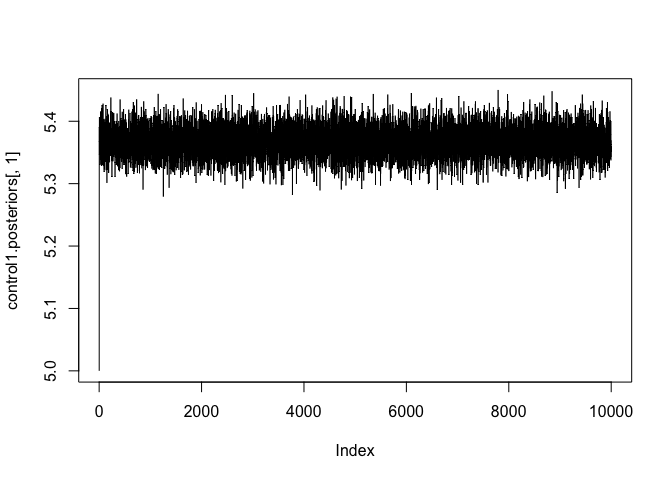
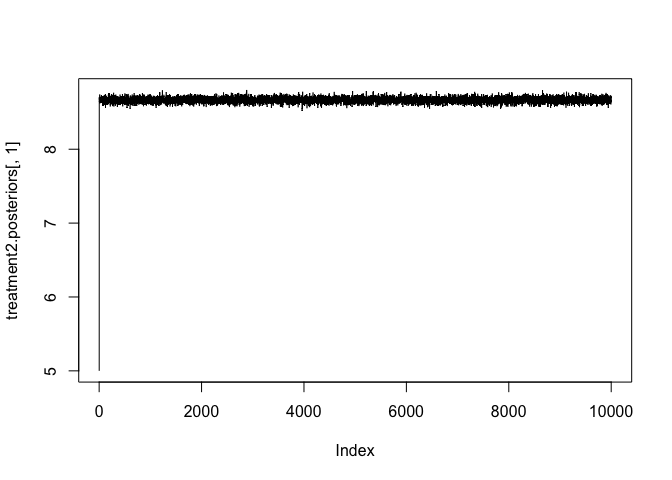

Bayesian A/B Testing for Measuring User Engagement in a Mobile App
================

<h3>

Imports

</h3>

``` python
import pandas as pd
import numpy as np
from scipy import stats
import datetime
```

<h3>

EDA : User Active

</h3>

``` python
user_active = pd.read_csv('../data/t1_user_active_min.csv')
# print(user_active.dtypes)
print(user_active.nunique())
```

    ## uid            46633
    ## dt               150
    ## active_mins      858
    ## dtype: int64

``` python
user_active.head()

# We can look at the percentile values and box plot to identify outliers
```

    ##    uid          dt  active_mins
    ## 0    0  2019-02-22          5.0
    ## 1    0  2019-03-11          5.0
    ## 2    0  2019-03-18          3.0
    ## 3    0  2019-03-22          4.0
    ## 4    0  2019-04-03          9.0

``` python
print(user_active['active_mins'].describe())
```

    ## count    1.066402e+06
    ## mean     3.616809e+01
    ## std      1.270484e+03
    ## min      1.000000e+00
    ## 25%      2.000000e+00
    ## 50%      5.000000e+00
    ## 75%      1.700000e+01
    ## max      9.999900e+04
    ## Name: active_mins, dtype: float64

``` python
user_active.boxplot(column=['active_mins'], figsize=(5,2), grid = False)
```

<!-- -->

``` python
# Since the data has outlier we can use $± 1.5*IQR$ to filter
perc75 = np.percentile(user_active['active_mins'], 75)
perc25 = np.percentile(user_active['active_mins'], 25)
IQR = perc75 - perc25

print(IQR)
```

    ## 15.0

``` python
user_active_no_outlier = user_active[(user_active['active_mins'] < perc75+1.5*IQR) & (user_active['active_mins'] > perc25-1.5*IQR)]
user_active_no_outlier.boxplot(column=['active_mins'], figsize=(3,2), grid = False)
```

<!-- -->

<h3>

EDA : User Variant

</h3>

``` python
user_variant = pd.read_csv('../data/t2_user_variant.csv')
# print(user_variant.dtypes)
print(user_variant.nunique())
```

    ## uid               50000
    ## variant_number        2
    ## dt                    1
    ## signup_date        2679
    ## dtype: int64

``` python
user_variant.head()
```

    ##    uid  variant_number          dt signup_date
    ## 0    0               0  2019-02-06  2018-09-24
    ## 1    1               0  2019-02-06  2016-11-07
    ## 2    2               0  2019-02-06  2018-09-17
    ## 3    3               0  2019-02-06  2018-03-04
    ## 4    4               0  2019-02-06  2017-03-09

``` python
user_variant['variant_number'].value_counts()
```

    ## 0    40000
    ## 1    10000
    ## Name: variant_number, dtype: int64

<h3>

KPIs aka Engagement Metrics for testing

</h3>

For our test, we can define two engagement
metrics

``` python
user_active_no_outlier_w_variant = user_active_no_outlier.merge(user_variant[['uid','variant_number']], on = 'uid')
# user_active_no_outlier_w_variant

# KPI 1 - average active time per user

user_active_grouped = user_active_no_outlier_w_variant.groupby(['uid','variant_number']).agg({'active_mins':sum, 'dt':np.size}).reset_index()
user_active_grouped['avg_active_mins'] = user_active_grouped['active_mins'] / user_active_grouped['dt']

control_group_kpi1 = user_active_grouped[user_active_grouped['variant_number'] == 0 ]
control_group_kpi1.describe()
```

    ##                 uid  variant_number  ...            dt  avg_active_mins
    ## count  37408.000000         37408.0  ...  37408.000000     37408.000000
    ## mean   19981.355780             0.0  ...     20.794777         5.367573
    ## std    11544.093547             0.0  ...     19.272487         4.595056
    ## min        0.000000             0.0  ...      1.000000         1.000000
    ## 25%    10009.750000             0.0  ...      6.000000         2.444444
    ## 50%    19957.500000             0.0  ...     14.000000         3.666667
    ## 75%    29978.250000             0.0  ...     31.000000         6.384615
    ## max    39999.000000             0.0  ...    104.000000        38.000000
    ## 
    ## [8 rows x 5 columns]

``` python
treatment_group_kpi1 = user_active_grouped[user_active_grouped['variant_number'] == 1 ]
treatment_group_kpi1.describe()
```

    ##                 uid  variant_number  active_mins           dt  avg_active_mins
    ## count   9197.000000          9197.0  9197.000000  9197.000000      9197.000000
    ## mean   45003.191910             1.0   145.341742    16.751332         6.916739
    ## std     2887.684235             0.0   199.562334    15.412130         4.457375
    ## min    40000.000000             1.0     1.000000     1.000000         1.000000
    ## 25%    42500.000000             1.0    22.000000     5.000000         3.800000
    ## 50%    45013.000000             1.0    65.000000    12.000000         5.750000
    ## 75%    47501.000000             1.0   175.000000    24.000000         8.735294
    ## max    49999.000000             1.0  1562.000000    87.000000        38.000000

``` python
treatment_group_kpi1.to_csv('../processed/post_treatment_kpi1.csv', index = False)
control_group_kpi1['avg_active_mins'].to_csv('../processed/control_kpi1.csv', index = False)
treatment_group_kpi1['avg_active_mins'].to_csv('../processed/treatment_kpi1.csv', index = False)

# KPI 2 - average active time per day
dt_active_grouped = user_active_no_outlier_w_variant.groupby(['dt','variant_number'])['active_mins'].mean().reset_index()

control_group_kpi2 = dt_active_grouped[dt_active_grouped['variant_number'] == 0 ]
control_group_kpi2.describe()
```

    ##        variant_number  active_mins
    ## count           150.0   150.000000
    ## mean              0.0     7.486985
    ## std               0.0     0.138304
    ## min               0.0     7.184011
    ## 25%               0.0     7.385034
    ## 50%               0.0     7.476412
    ## 75%               0.0     7.573460
    ## max               0.0     7.899371

``` python
treatment_group_kpi2 = dt_active_grouped[dt_active_grouped['variant_number'] == 1 ]
treatment_group_kpi2.describe()
```

    ##        variant_number  active_mins
    ## count           150.0   150.000000
    ## mean              1.0     8.670702
    ## std               0.0     0.432387
    ## min               1.0     7.708255
    ## 25%               1.0     8.393723
    ## 50%               1.0     8.598157
    ## 75%               1.0     8.911670
    ## max               1.0    10.203374

``` python
control_group_kpi2['active_mins'].to_csv('../processed/control_kpi2.csv', index = False)
treatment_group_kpi2['active_mins'].to_csv('../processed/treatment_kpi2.csv', index = False)
```

<h3>

Let go R

</h3>

``` r
control1 <- read.csv('../processed/control_kpi1.csv')
treatment1 <- read.csv('../processed/treatment_kpi1.csv')

control2 <- read.csv('../processed/control_kpi2.csv')
treatment2 <- read.csv('../processed/treatment_kpi2.csv')

eda_plots <- function(control, treatment, title){
  hist(control[,1], probability = T)
  lines(density(control[,1]))
  
  hist(treatment[,1], probability = T)
  lines(density(treatment[,1]))
  
  boxplot(list("Control" = control[,1], "Treatment" = treatment[,1]), main = title, ylab = 'minutes' )
}
eda_plots(control1, treatment1, 'Distribution of avg active time per user')
```

<!-- --><!-- --><!-- -->

``` r
eda_plots(control2, treatment2, 'Distribution of avg active time per day')
```

<!-- --><!-- --><!-- -->

``` r
summary(control1)
```

    ##  avg_active_mins 
    ##  Min.   : 1.000  
    ##  1st Qu.: 2.444  
    ##  Median : 3.667  
    ##  Mean   : 5.368  
    ##  3rd Qu.: 6.385  
    ##  Max.   :38.000

``` r
sqrt(var(control1[1]))
```

    ##                 avg_active_mins
    ## avg_active_mins        4.595056

``` r
summary(treatment1)
```

    ##  avg_active_mins 
    ##  Min.   : 1.000  
    ##  1st Qu.: 3.800  
    ##  Median : 5.750  
    ##  Mean   : 6.917  
    ##  3rd Qu.: 8.735  
    ##  Max.   :38.000

``` r
sqrt(var(treatment1[1]))
```

    ##                 avg_active_mins
    ## avg_active_mins        4.457375

Priors and Posteriors

$$  $$

Priors? Analysis to determine priors can be performed on user engagement
behavior before the UI change

Lets go
Gibbs

``` r
get_MCMC_samples <- function(Y, mu0, tau20, sigma20, nu0, m, mu_init, sigma2_init){
  n = length(Y)
  # a = b = 1
# iterations
  
  trace <- array(NA, dim = c(m,2)) # to store MCMC samples

  # Initial values
  # p = 0.8
  # theta1 = 100
  # theta2 = 170
  # sigma12 = 250
  # sigma22 = 250
  # 
  mu = mu_init
  sigma2 = sigma2_init
    
  # X = rbinom(n, 1, p)
  # 
  # n1 = sum(X)
  # n2 = n - n1
  
  ## Gibbs Sampler
  for (i in 1:m) {
    
    # Store values
    trace[i,1] = mu
    trace[i,2] = sigma2

    ybar = mean(Y)
    
    # Update mean
    mu = rnorm(1, ((mu0 / tau20) + ((n * ybar) / sigma2)) / ((1 / tau20) + (n / sigma2)), sqrt(1 / ((n / sigma2) + (1 / tau20))))

    # Update sigmas
    sigma2 = 1 / rgamma(1, (n+nu0) / 2, (sum((Y-mu)^2)+ (nu0 * sigma20 )) / 2)
  }
  trace
}
```

KPI 1

``` r
## KPI 1
mu0 = 5
tau20 = 1
sigma20 = 16
nu0 = 1
m = 10000 
mu_initial = 5
sigma2_initial = 16

control1.posteriors <- get_MCMC_samples(control1$avg_active_mins, mu0, tau20, sigma20, nu0, m, mu_initial, sigma2_initial)
treatment1.posteriors <- get_MCMC_samples(treatment1$avg_active_mins, mu0, tau20, sigma20, nu0, m, mu_initial, sigma2_initial)

plot(control1.posteriors[,1], type = 'l')
```

<!-- -->

``` r
plot(treatment1.posteriors[,1], type = 'l')
```

<!-- -->

``` r
plot(control1.posteriors[,2], type = 'l')
```

<!-- -->

``` r
plot(treatment1.posteriors[,2], type = 'l')
```

<!-- -->

``` r
require(coda)
```

    ## Loading required package: coda

    ## Warning: package 'coda' was built under R version 3.6.2

``` r
control1.mcmc <- mcmc(control1.posteriors, start=20) # burn in 20
summary(control1.mcmc)
```

    ## 
    ## Iterations = 20:10019
    ## Thinning interval = 1 
    ## Number of chains = 1 
    ## Sample size per chain = 10000 
    ## 
    ## 1. Empirical mean and standard deviation for each variable,
    ##    plus standard error of the mean:
    ## 
    ##        Mean      SD  Naive SE Time-series SE
    ## [1,]  5.367 0.02395 0.0002395      0.0002255
    ## [2,] 21.112 0.16377 0.0016377      0.0016377
    ## 
    ## 2. Quantiles for each variable:
    ## 
    ##        2.5%    25%    50%    75%  97.5%
    ## var1  5.321  5.351  5.367  5.383  5.414
    ## var2 20.809 21.010 21.113 21.218 21.417

``` r
effectiveSize(control1.mcmc)
```

    ##     var1     var2 
    ## 11277.11 10000.00

``` r
treatment1.mcmc <- mcmc(treatment1.posteriors, start=20) # burn in 20
summary(treatment1.mcmc)
```

    ## 
    ## Iterations = 20:10019
    ## Thinning interval = 1 
    ## Number of chains = 1 
    ## Sample size per chain = 10000 
    ## 
    ## 1. Empirical mean and standard deviation for each variable,
    ##    plus standard error of the mean:
    ## 
    ##        Mean     SD Naive SE Time-series SE
    ## [1,]  6.912 0.0504 0.000504       0.000504
    ## [2,] 19.876 0.2977 0.002977       0.003054
    ## 
    ## 2. Quantiles for each variable:
    ## 
    ##       2.5%    25%    50%    75%  97.5%
    ## var1  6.82  6.881  6.912  6.944  7.004
    ## var2 19.32 19.675 19.872 20.070 20.467

``` r
effectiveSize(treatment1.mcmc)
```

    ##      var1      var2 
    ## 10000.000  9501.014

``` r
mean(treatment1.posteriors[,1] > control1.posteriors[,1])
```

    ## [1] 0.9999

``` r
mean((treatment1.posteriors[,1] - control1.posteriors[,1]) > 1.5)
```

    ## [1] 0.8053

``` r
mean(treatment1.posteriors[,1] / control1.posteriors[,1])
```

    ## [1] 1.287889

``` r
plot(c(4,8), c(0,20), type='n',  xlab = expression(mu), ylab = 'Density', main = 'Posterior distribution for'~ mu)
lines(density(treatment1.posteriors[,1]), col= 'blue')
lines(density(control1.posteriors[,1]), col= 'orange')
legend('topleft', col = c('blue','orange'), lty = c(1,1), legend = c('Treatment','Control' ))
```

<!-- -->

``` r
plot(c(15,30), c(0,20), type='n',  xlab = expression(sigma^2), ylab = 'Density', main = 'Posterior distribution for'~ sigma^2)
lines(density(treatment1.posteriors[,2]), col= 'blue')
lines(density(control1.posteriors[,2]), col= 'orange')
legend('topleft', col = c('blue','orange'), lty = c(1,1), legend = c('Treatment','Control' ))
```

<!-- -->

``` r
plot(c(-1,2), c(0,20), type='n',  xlab = expression(mu[diff]), ylab = 'Density', main = 'Posterior distribution for'~ mu[diff])
lines(density(treatment1.posteriors[,1] - control1.posteriors[,1]))
```

<!-- -->

KPI 2

``` r
## KPI 2
mu0 = 6.4
tau20 = 1
sigma20 = 0.16*0.16
nu0 = 1
m = 10000 
mu_initial = 5
sigma2_initial =  1

control2.posteriors <- get_MCMC_samples(control2$active_mins, mu0, tau20, sigma20, nu0, m, mu_initial, sigma2_initial)
treatment2.posteriors <- get_MCMC_samples(treatment2$active_mins, mu0, tau20, sigma20, nu0, m, mu_initial, sigma2_initial)

plot(control2.posteriors[,1], type = 'l')
```

<!-- -->

``` r
plot(treatment2.posteriors[,1], type = 'l')
```

<!-- -->

``` r
plot(control2.posteriors[,2], type = 'l')
```

<!-- -->

``` r
plot(treatment2.posteriors[,2], type = 'l')
```

<!-- -->

``` r
require(coda)
control2.mcmc <- mcmc(control2.posteriors, start=20) # burn in 20
summary(control2.mcmc)
```

    ## 
    ## Iterations = 20:10019
    ## Thinning interval = 1 
    ## Number of chains = 1 
    ## Sample size per chain = 10000 
    ## 
    ## 1. Empirical mean and standard deviation for each variable,
    ##    plus standard error of the mean:
    ## 
    ##         Mean      SD  Naive SE Time-series SE
    ## [1,] 7.48659 0.02739 0.0002739      0.0002739
    ## [2,] 0.01952 0.01007 0.0001007      0.0001007
    ## 
    ## 2. Quantiles for each variable:
    ## 
    ##         2.5%     25%     50%     75%   97.5%
    ## var1 7.46405 7.47917 7.48675 7.49449 7.50979
    ## var2 0.01545 0.01782 0.01924 0.02085 0.02441

``` r
effectiveSize(control1.mcmc)
```

    ##     var1     var2 
    ## 11277.11 10000.00

``` r
treatment2.mcmc <- mcmc(treatment2.posteriors, start=20) # burn in 20
summary(treatment2.mcmc)
```

    ## 
    ## Iterations = 20:10019
    ## Thinning interval = 1 
    ## Number of chains = 1 
    ## Sample size per chain = 10000 
    ## 
    ## 1. Empirical mean and standard deviation for each variable,
    ##    plus standard error of the mean:
    ## 
    ##        Mean      SD  Naive SE Time-series SE
    ## [1,] 8.6670 0.05072 0.0005072      0.0005072
    ## [2,] 0.1885 0.02365 0.0002365      0.0002388
    ## 
    ## 2. Quantiles for each variable:
    ## 
    ##       2.5%    25%    50%    75%  97.5%
    ## var1 8.597 8.6439 8.6679 8.6911 8.7352
    ## var2 0.150 0.1726 0.1866 0.2022 0.2368

``` r
effectiveSize(treatment2.mcmc)
```

    ##      var1      var2 
    ## 10000.000  9814.081

``` r
mean(treatment2.posteriors[,1] > control2.posteriors[,1])
```

    ## [1] 0.9999

``` r
mean(treatment2.posteriors[,1] > control2.posteriors[,1])
```

    ## [1] 0.9999

``` r
mean(treatment2.posteriors[,1] / control2.posteriors[,1])
```

    ## [1] 1.157664

``` r
plot(c(4,10), c(0,50), type='n',  xlab = expression(mu), ylab = 'Density', main = 'Posterior distribution for'~ mu)
lines(density(treatment2.posteriors[,1]), col= 'blue')
lines(density(control2.posteriors[,1]), col= 'orange')
legend('topleft', col = c('blue','orange'), lty = c(1,1), legend = c('Treatment','Control' ))
```

<!-- -->

``` r
plot(c(-1,2), c(0,20), type='n',  xlab = expression(mu[diff]), ylab = 'Density', main = 'Posterior distribution for'~ mu[diff])
lines(density(treatment2.posteriors[,1] - control2.posteriors[,1]))
```

<!-- --> Pre-Post
analysis

``` python
treatment_kpi1 = pd.read_csv('../processed/post_treatment_kpi1.csv')
treatment_kpi1
```

    ##         uid  variant_number  active_mins  dt  avg_active_mins
    ## 0     40000               1         25.0   3         8.333333
    ## 1     40001               1        299.0  32         9.343750
    ## 2     40002               1        183.0  26         7.038462
    ## 3     40004               1         56.0   9         6.222222
    ## 4     40005               1        289.0  36         8.027778
    ## ...     ...             ...          ...  ..              ...
    ## 9192  49995               1         95.0  18         5.277778
    ## 9193  49996               1        156.0  13        12.000000
    ## 9194  49997               1        379.0  53         7.150943
    ## 9195  49998               1        317.0  29        10.931034
    ## 9196  49999               1         39.0   6         6.500000
    ## 
    ## [9197 rows x 5 columns]

``` python
all_kpi1 = pd.read_csv('../processed/pre_all_kpi1.csv')
all_kpi1
```

    ##          uid  active_mins  dt  avg_active_mins
    ## 0          0         70.0  21         3.333333
    ## 1          1        245.0  11        22.272727
    ## 2          2         37.0  10         3.700000
    ## 3          3         69.0  18         3.833333
    ## 4          4         66.0  28         2.357143
    ## ...      ...          ...  ..              ...
    ## 49638  49995         34.0  13         2.615385
    ## 49639  49996        200.0  35         5.714286
    ## 49640  49997         83.0  23         3.608696
    ## 49641  49998        124.0  24         5.166667
    ## 49642  49999         45.0   4        11.250000
    ## 
    ## [49643 rows x 4 columns]

``` python
treatment_group_w_pre_post_mins = treatment_kpi1[['uid','avg_active_mins']].merge(all_kpi1[['uid','avg_active_mins']], on= 'uid', suffixes = ['_post', '_pre'])
treatment_group_w_pre_post_mins[['avg_active_mins_pre', 'avg_active_mins_post']].to_csv('../processed/pre_post_treatment_kp1.csv', index = False)
```

``` r
library(MASS)
pre_post_treatment <- read.csv('../processed/pre_post_treatment_kp1.csv')
# cov(pre_post_treatment)
mu0 <- c(5,5)
nu0 = 4 # vague prior belief
lambda0 <- matrix(c(1, 0.8, 0.8, 1), byrow = T, nrow = 2)
s0 <- matrix(c(16, 12.8, 12.8, 16), byrow = T, nrow = 2)
# s0_inv = solve(s0)
# lambda0_inv = solve(lambda0)

get_MCMC_samples <- function(data, repl, mu0, nu0, lambda0, s0) {
  p = ncol(data)
  n <- nrow(data)
  y.mean <- apply(data, MARGIN  = 2, FUN = mean)
  
  s0_inv = solve(s0)
  lambda0_inv = solve(lambda0)
  
  trace <- list(
    mu = array(NA, dim = c(repl, p)), 
    sigma = array(NA, dim =c(repl, p, p)),
    y.pred = array(NA, dim = c(repl, p))
  )
  
  # initial values
  
  # set.seed(1)
  mu <- mvrnorm(1, mu=mu0, Sigma= lambda0)
  phi <- rWishart(n = 1, df = nu0, Sigma = s0_inv)[,,1]
  sigma <- solve(phi)
  
  y.pred <- mvrnorm(1, mu = mu, Sigma = sigma)
    
  trace$mu[1,] <- mu
  trace$sigma[1,,] <- sigma
  trace$y.pred[1,] <- y.pred
  
  # Sampler
  
  for (i in 2:repl){
    mu_n <- solve(lambda0_inv + n*phi) %*% (n * phi %*% y.mean + lambda0_inv %*% mu0)
    sigma_n <- solve( lambda0_inv + n*phi)
    mu <- mvrnorm(1, mu=mu_n, Sigma= sigma_n) #posterior mean vector
    
    nu_n <- n + nu0
    SS <- array(
      apply( apply(data, MARGIN = 1, FUN = function(x) (x - mu) %*% t(x - mu)), MARGIN = 1, FUN = sum ),
      dim = rep(dim(data)[2], dim(data)[2])
    )
    s_n_inv <- solve(s0 + SS)
    phi <- rWishart(n=1, df=nu_n, Sigma=s_n_inv)[,,1]
    sigma <- solve(phi) # posteror var-cov matrix
    
    trace$mu[i,] <- mu
    trace$sigma[i,,] <- sigma
    trace$y.pred[i,] <- mvrnorm(1, mu = mu, Sigma = sigma)
  }
  trace
  }
repl = 1000
pre_post_mcmc = get_MCMC_samples(pre_post_treatment, repl, mu0, nu0, lambda0, s0) # using the priors defined in a)
```

``` r
mean(pre_post_mcmc$mu[,1] < pre_post_mcmc$mu[,2])
```

    ## [1] 1

``` r
mean(pre_post_mcmc$mu[,2]- mean(pre_post_mcmc$mu[,1]) > 2)
```

    ## [1] 0.971

``` r
mean( pre_post_mcmc$mu[,2]/pre_post_mcmc$mu[,1])
```

    ## [1] 1.432373

``` r
plot(c(0,10), c(0,50), type='n',  xlab = expression(mu), ylab = 'Density', main = 'Posterior distribution for'~ mu)
lines(density(pre_post_mcmc$mu[,1]), col= 'blue')
lines(density(pre_post_mcmc$mu[,2]), col= 'orange')
legend('topleft', col = c('blue','orange'), lty = c(1,1), legend = c('Before','After' ))
```

<!-- -->

``` r
plot(density(pre_post_mcmc$mu[,2]-pre_post_mcmc$mu[,1]))
```

<!-- -->
