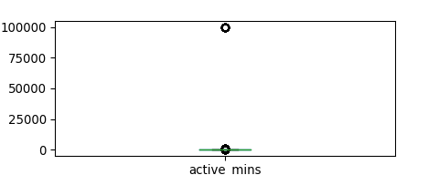

Prior Analysis
================

``` python
import pandas as pd
import numpy as np
from scipy import stats
import datetime
import matplotlib.pyplot as plt 
```

``` python
user_active_pre = pd.read_csv('../data/t3_user_active_min_pre.csv')
# print(user_active_pre.dtypes)
print(user_active_pre.nunique())
```

    ## uid            49697
    ## dt               180
    ## active_mins      857
    ## dtype: int64

``` python
user_active_pre.head()
```

    ##    uid          dt  active_mins
    ## 0    0  2018-09-24          3.0
    ## 1    0  2018-11-08          4.0
    ## 2    0  2018-11-24          3.0
    ## 3    0  2018-11-28          6.0
    ## 4    0  2018-12-02          6.0

``` python
print(user_active_pre['active_mins'].describe())
```

    ## count    1.190093e+06
    ## mean     3.220315e+01
    ## std      1.181531e+03
    ## min      1.000000e+00
    ## 25%      2.000000e+00
    ## 50%      4.000000e+00
    ## 75%      1.400000e+01
    ## max      9.999900e+04
    ## Name: active_mins, dtype: float64

``` python
user_active_pre.boxplot(column=['active_mins'], figsize=(5,2), grid = False)
```

<!-- -->

``` python
perc75 = np.percentile(user_active_pre['active_mins'], 75)
perc25 = np.percentile(user_active_pre['active_mins'], 25)
IQR = perc75 - perc25

user_active_pre_no_outlier = user_active_pre[(user_active_pre['active_mins'] < perc75+1.5*IQR) & (user_active_pre['active_mins'] > perc25-1.5*IQR)]

user_active_pre_no_outlier['active_mins'].describe()
```

    ## count    1.024286e+06
    ## mean     6.377799e+00
    ## std      6.778294e+00
    ## min      1.000000e+00
    ## 25%      2.000000e+00
    ## 50%      4.000000e+00
    ## 75%      8.000000e+00
    ## max      3.100000e+01
    ## Name: active_mins, dtype: float64

``` python
user_active_pre_no_outlier.boxplot(column=['active_mins'], figsize=(3,2), grid = False)
user_active_pre_no_outlier
```

    ##            uid          dt  active_mins
    ## 0            0  2018-09-24          3.0
    ## 1            0  2018-11-08          4.0
    ## 2            0  2018-11-24          3.0
    ## 3            0  2018-11-28          6.0
    ## 4            0  2018-12-02          6.0
    ## ...        ...         ...          ...
    ## 1190087  49998  2019-02-05         12.0
    ## 1190088  49999  2018-09-15          5.0
    ## 1190089  49999  2018-09-26          8.0
    ## 1190090  49999  2018-10-20         29.0
    ## 1190091  49999  2018-12-14          3.0
    ## 
    ## [1024286 rows x 3 columns]

``` python
user_active_grouped = user_active_pre_no_outlier.groupby('uid').agg({'active_mins':sum, 'dt':np.size}).reset_index()
user_active_grouped['avg_active_mins'] = user_active_grouped['active_mins'] / user_active_grouped['dt']
user_active_grouped.describe()
```

    ##                 uid   active_mins            dt  avg_active_mins
    ## count  49643.000000  49643.000000  49643.000000     49643.000000
    ## mean   24988.587152    131.593377     20.633040         5.006734
    ## std    14427.771370    197.608730     20.117171         3.589021
    ## min        0.000000      1.000000      1.000000         1.000000
    ## 25%    12496.500000     17.000000      6.000000         2.600000
    ## 50%    24987.000000     49.000000     14.000000         3.833333
    ## 75%    37479.500000    147.000000     30.000000         6.165612
    ## max    49999.000000   1669.000000    118.000000        31.000000

``` python
user_active_grouped.to_csv('../processed/pre_all_kpi1.csv', index = False)
```

``` python
dt_active_grouped = user_active_pre_no_outlier.groupby(['dt'])['active_mins'].mean().reset_index()
dt_active_grouped.describe()
```

    ##        active_mins
    ## count   180.000000
    ## mean      6.390603
    ## std       0.161475
    ## min       5.995502
    ## 25%       6.293235
    ## 50%       6.392275
    ## 75%       6.504988
    ## max       6.759081

``` python
plt.hist(dt_active_grouped['active_mins'])
```

    ## (array([ 8.,  7., 13., 19., 32., 34., 36., 14., 12.,  5.]), array([5.99550169, 6.07185965, 6.14821761, 6.22457557, 6.30093353,
    ##        6.37729149, 6.45364944, 6.5300074 , 6.60636536, 6.68272332,
    ##        6.75908128]), <a list of 10 Patch objects>)
